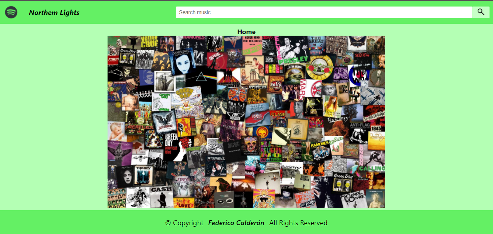
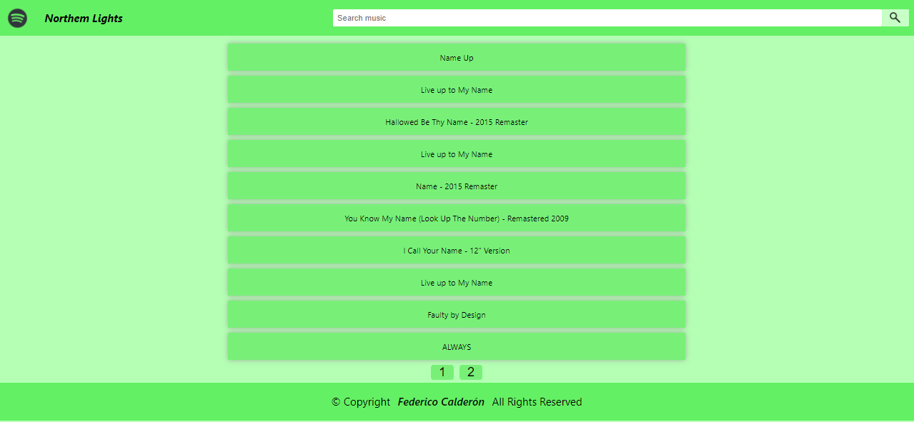
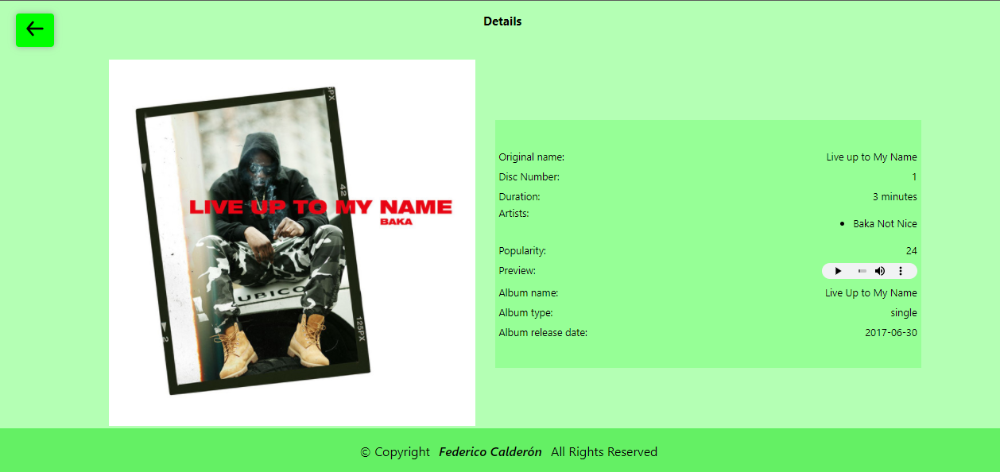
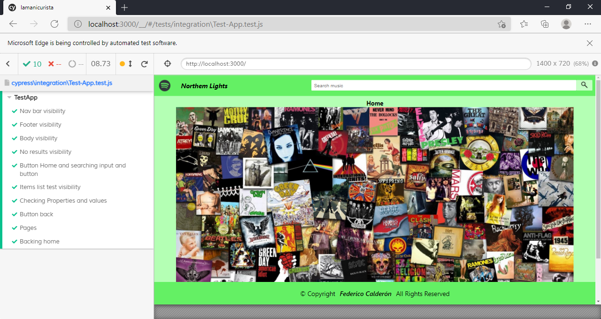

<h1>Spotify-App</h1>
<h3>Requirements</h3>

The only necessary requirement is have Spotify API credentials

<a href='https://developer.spotify.com/dashboard/applications'>Get it here </a>

( Create an account )

<h3>Environment Variables</h3>

CLIENT_ID = 

CLIENT_SECRET = 

It is necessary that once the spotify API credentials are obtained, you have to copy and paste them in the .env file of the root location 

<h3>Setting up</h3>
<!-- 
Clone this repository
 -->
<!-- <h5>Run the next commands to set up aplication</h5> -->

Clone this repository and run the next commands in root location 

<ul>
    <li>yarn</li>
    <li>yarn start</li>
</ul>
<h3>To run the tests</h3>
<ul>
    <li>yarn run cypress open</li>
</ul>

<h3>I used</h3>
<ul>
    <li>axios</li>
    <li>cypress</li>
    <li>react</li>
    <li>react-dom</li>
    <li>react-dotenv</li>
    <li>react-redux</li>
    <li>react-router-dom</li>
    <li>react-scripts</li>
    <li>redux</li>
    <li>redux-thunk</li>
    <li>spotify</li>
    <li>web-vitals</li>
</ul>

<h2>Website</h2>

